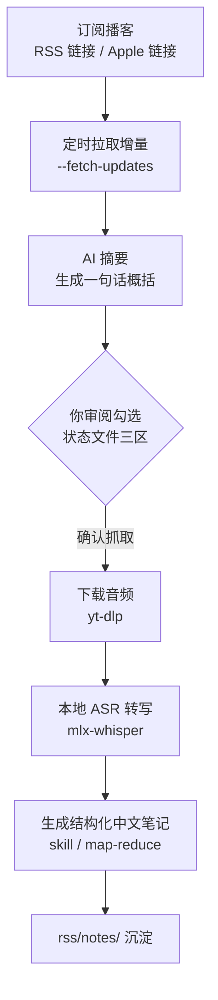

# rss-grab

订阅 RSS 播客 → 自动拉取增量 → AI 摘要 → 审阅勾选 → 下载 → ASR 转写 → 生成结构化中文笔记。

> **这是什么**：项目主体是一个 **Agent skill 包**（`.agents/skills/rss-grab/`），供 **Codex / Claude Code 等 AI 助手**编排使用——在对话里发一个播客 RSS 链接（或 Apple Podcasts 链接），说"订阅这个播客、拉取新期数、把感兴趣的转写生成笔记"，Agent 会按 skill 指令自动完成整条流水线。各脚本也自带命令行入口，可纯命令行操作（见「快速开始」）。

> ⚠️ **平台要求：仅支持 macOS（Apple Silicon，M1/M2/M3/M4）**
> ASR 转写依赖 mlx-whisper（Apple 的 MLX 框架，仅 Apple Silicon 可用）。
> **Windows / Linux / Intel Mac 用户**：请改用本地 [faster-whisper](https://github.com/SYSTRAN/faster-whisper) 或 [whisper.cpp](https://github.com/ggerganov/whisper.cpp) 做 ASR，或使用其他在线 ASR 服务，然后按 rss/transcripts/ 的格式输出分段时间戳内容（后续流水线依赖时间戳分段落盘）。
> 跨平台支持已在 Roadmap 中（见文末）。

## 为什么选 rss-grab

**它解决什么问题**：播客信息密度高、一期 35-60 分钟，靠"听"做知识管理效率低——你听完就忘，回找时只能凭记忆翻播放器历史。rss-grab 把**"听播客"变成"读笔记"**：自动拉取你订阅播客的新期数、生成摘要供你快速判断值不值得听、把选中的转写成文字稿、再生成结构化中文笔记沉淀下来——整个流程不靠你在播放器里手动操作，订阅后基本自动化。

**使用流程**：



**真实使用方式**（作者日常用法）：在 Apple Podcasts 里找到想订阅的节目，复制节目 web 链接（`podcasts.apple.com/...`）发给 Agent——Agent 会自动反推出这个节目的 RSS feed 地址，用 `--subscribe` 完成订阅。之后节目每出新期，rss-grab 自动拉取增量 + 生成 AI 摘要，你在状态文件里勾选想深挖的期数，它再下载音频、本地转写、生成结构化笔记。**全程不需要手动找 RSS 地址、不需要记命令**。

**一句话定位**：rss-grab 是**开源的本地播客笔记工具**——订阅、下载、ASR 转写都在你机器上完成（Apple Silicon 本地推理），AI 摘要与笔记生成调用 OpenAI 兼容 LLM API。

**适合你，如果你**：
- **播客重度听众**：一期期听下来，想把内容沉淀成可检索的笔记，而不是听完就忘
- **主要听中文播客**：想要符合中文表达习惯的结构化笔记，而非英文优先的通用摘要
- **在意成本与隐私**：转写完全在本地完成（不消耗 LLM token、音频不出设备），只为摘要/笔记付少量的token
- **喜欢"收件箱"式工作流**：订阅后自动拉新期数、AI 摘要筛一遍、勾选想听的深挖，像处理邮件一样
- **用 Apple Silicon Mac**（M1/M2/M3/M4）：核心流程（抓取 + 转写）完全离线可用

**它做了什么**：
- **本地抓取 + 本地转写**：抓取与 ASR 转写（mlx-whisper，Apple Silicon 本地推理）都在你机器上完成；原始音频不离开设备，转写文本仅在与 LLM API 交互时上传（见「LLM 配置」）
- **三区状态机**：每源一份 Markdown 状态文件（待确认 / 确认 / 已转化），跟你用邮箱一样自然
- **Apple Podcasts 反推**：粘一个 Apple 链接，自动反推 RSS feed URL 订阅
- **长度自适应**：短播客用 skill 模式（快），长播客自动切 map-reduce（细）
- **笔记模板可自定义**：笔记结构由 `templates/` 下的 Markdown 模板驱动（带 `style` / `description` / `required_sections` frontmatter），新增或改一个模板文件即可定制输出结构，不用改代码；生成前 LLM 会按内容自动挑选最匹配的模板（当前内置「访谈播客」中文模板）

**为什么支持 map-reduce**：长播客（转写稿 >50K 字符，约 2 小时以上）单次塞给 LLM 生成笔记会超出模型 context、或质量下降。rss-grab 自动做 **map-reduce 分治**：先把转写稿按 token 切成多块、并发各跑一次 LLM 生成段级摘要（MAP），再把段级摘要合并成一次调用输出完整笔记（REDUCE）。好处：
- **无长度上限**：多长的音频都能转成完整笔记（>2h 的访谈、特辑都行）
- **更省 token**：每块只精读一次，摘要精简后再汇总，比一次塞全文便宜
- **质量更高**：每块单独精读不丢上下文，长播客的笔记完整度反而更好
- **断点恢复**：分段处理，单块失败可重试，不用全量重来

触发是自动的：`decide_mode` 按字符数判断（<50K skill / ≥50K map-reduce），用户无感。实测多数播客（35-60 分钟，20-40K 字符）走 skill 模式。

**实测（2026-08，MacBook Pro M1 16GB）**：
- 本地转写模型跑得动——**2 篇共约 2.5 小时音频，转写约 10 分钟**（mlx-whisper large-v3-turbo，Apple Silicon 加速）
- 转写不消耗 LLM token、模型本地部署成本低、推理速度快——**音频转写是"免费"的（只花电费），只有 AI 摘要/笔记生成才消耗 token**

**诚实承认的限制**（按重要性排序）：
- **仅 macOS Apple Silicon**（mlx-whisper 硬性要求）— Windows/Linux 用户需自己改用 faster-whisper
- **CLI 优先**（没有 GUI）— 非技术用户上手有门槛

## 核心能力

| 能力 | 说明 |
|---|---|
| 订阅模式 | 订阅表 + 每源一个状态文件（待确认 / 确认 / 已转化 三区） |
| 定时增量拉取 | 增量命令幂等、可重复执行；可配合 launchd/cron 定时自动拉新期数 + AI 摘要 |
| AI 摘要 | 每期根据简介调用LLM生成"一句话概括"，用户无需打开音频即可判断是否值得听 |
| 批量下载 | 利用 yt-dlp 下载音频（串行 + CDN 礼仪间隔） |
| ASR 转写 | mlx-whisper large-v3-turbo（仅 Apple Silicon），带**时长完整性校验** |
| 笔记生成 | 模板自适应 + 长度档位（<50K skill 模式 / ≥50K map-reduce），20 并发批量 |
| Apple Podcasts 反向解析 | 网页链接 → RSS feed URL 自动提取 |
| LLM 兼容 | OpenAI 兼容接口，不绑定任何特定服务，可配任意兼容服务 |

### LLM 调用策略

批量调用 LLM 时内置了并发与限流保护，避免打爆 API 或触发限流：

- **并发 20**：AI 摘要、批量笔记生成默认 20 并发（实测无 429 限流）
- **发射间隔**：每请求间隔 ≥2s（摘要 ≥5s），避免瞬时请求风暴
- **429 熔断降级**：遇到限流自动降并发（摘要 20→15；笔记 20→15→10），并指数退避重试
- **断点续跑**：中断后重跑自动跳过已处理项（checkpoint 落盘），不会重复消耗 token
- **map-reduce 分片并发 4**：长播客 MAP 阶段分块并行精读

## 跟同类项目对比

| 维度 | rss-grab | Podwise（闭源） | MrRSS | RSS-GPT | Meetily |
|---|---|---|---|---|---|
| **播客专门** | ✅ | ✅ | ❌ 通用 RSS | ❌ 通用 RSS | ❌ 会议录音 |
| **本地 ASR** | ✅ mlx-whisper | ❌ 云端 | ❌ | ❌ | ✅ Whisper |
| **增量订阅模式** | ✅ 三区状态机 | ✅ 自动 | ✅ | ❌ 静态 | ❌ |
| **Apple Podcasts 反推** | ✅ | ❌ | ❌ | ❌ | ❌ |
| **中文模板自适应** | ✅ | ⚠️ 英文优先 | ⚠️ 通用 | ⚠️ 通用 | ⚠️ 通用 |
| **离线运行** | ⚠️ 转写离线/摘要需联网 | ❌ | ⚠️ | ❌ | ✅ |
| **跨平台** | ❌ macOS only | ✅ Web/App | ✅ Docker | ✅ Actions | ✅ Tauri |
| **开源协议** | ✅ MIT | ❌ | ✅ | ✅ | ✅ MIT |
| **价格** | 免费 | $5.9/月起 | 免费 | 免费 | 免费 |
| **数据隐私** | ⚠️ 本地转写/LLM 见上 | ❌ 云端 | ⚠️ 自托管 | ❌ 云端 | ✅ |

**结论**：
- 与**云端播客笔记服务**相比，rss-grab 强调**开源 + 离线 + 中文化**
- 跟 **MrRSS / RSS-GPT** 偏通用 RSS 不同，rss-grab 专注**音频类 RSS** + **本地 ASR** + **长笔记生成**
- 跟 **Meetily** 思路接近（本地优先），但定位不同：rss-grab 处理"播客"，Meetily 处理"会议录音"

## 项目亮点

- **零门槛订阅**：在 Apple Podcasts 复制节目链接给 Agent，自动反推 RSS feed 完成订阅——不用手动找 RSS 地址
- **把"听"变成"读"**：播客 → 结构化中文笔记（含 TL;DR、关键引用、话题时间轴、信息可信度），可检索、可回看，告别听完就忘
- **收件箱式工作流**：订阅后自动拉新期数 + AI 摘要，勾选想深挖的期数才下载转写——不盲目抓取所有期数，节省磁盘、token 和时间
- **AI 驱动、自然语言编排**：面向 Codex / Claude Code 等 Agent 设计，对话即可驱动整条流水线，无需记忆命令
- **开源可审计**：MIT 协议，全流程本地运行，代码透明，数据自己掌控

## LLM 配置（OpenAI 兼容）

- 代码通过 OpenAI 兼容接口调用 LLM，**不绑定任何特定服务**——你的 `.env` 配哪家就用哪家
- **支持任意 OpenAI 兼容服务**（DeepSeek / OpenAI / 本地 Ollama 等），只需在 `.agents/skills/rss-grab/scripts/.env` 配置（模板见根目录 `.env.example`）：
  ```bash
  LLM_API_KEY=your-key                    # 你的服务 API key
  LLM_BASE_URL=https://your-llm-service/v1   # 你的服务 base_url
  LLM_MODEL=your-model                    # 你的模型名
  ```
- 未配置 `LLM_BASE_URL` 时脚本会报错提示。

## 两种使用方式

### 方式 A：Agent 驱动（推荐，面向 Codex / Claude Code 等 AI 助手）

把 `.agents/skills/` 目录放进 AI 助手能访问的项目目录（Codex 的项目目录、或 Claude Code 的工作区），然后在对话中直接用自然语言驱动：

```
"订阅这个播客：https://podcasts.apple.com/xxx
 拉取新期数，把待确认区里感兴趣的几期转写并生成笔记"
```

Agent 会读取 `.agents/skills/rss-grab/SKILL.md` 的指令，自动完成：订阅反推 → 拉增量 → AI 摘要 → 三区状态文件 → 勾选抓取 → ASR 转写 → 模板笔记。**无需记住任何命令**——skill 会把每一步要执行什么、产物落在哪都告诉你。

> 💡 把 `.agents/skills/` 当作"技能库"：除了 `rss-grab` 主 skill，共享模块 `_shared/`（ASR、env 加载、路径定位、批量笔记）会被 skill 自动引用，一并放入即可。

### 方式 B：命令行直接使用

不依赖 Agent，直接 `python3 .agents/skills/rss-grab/scripts/xxx.py` 跑各脚本（`--help` 查看参数）。适合想精确控制每一步、或做自动化脚本的用户。

## 安装

```bash
# 依赖（macOS）
brew install yt-dlp ffmpeg
pip3 install -r requirements.txt   # openai + mlx-whisper（模型见下）

# MLX-Whisper 模型（仅 Apple Silicon）
# 1. 下载模型权重（约 1.6GB，只需一次）
huggingface-cli download mlx-community/whisper-large-v3-turbo
# 2. 建软链指向模型
mkdir -p tools/asr-poc/models
ln -s ~/.cache/huggingface/hub/models--mlx-community--whisper-large-v3-turbo \
  tools/asr-poc/models/whisper-large-v3-turbo
# （若尚未安装 huggingface-cli：brew install huggingface-cli 或 pip install "huggingface_hub[cli]"）

# API Key（AI 摘要 + 笔记生成）
# 模板见根目录 .env.example；生效位置是 scripts/ 目录（脚本从这里读）
cp .env.example .agents/skills/rss-grab/scripts/.env
# 编辑 .agents/skills/rss-grab/scripts/.env，填入你的 LLM_API_KEY（OpenAI 兼容接口）
```

## 快速开始（命令行）

```bash
# 1. 订阅一个播客（RSS feed URL 或 Apple Podcasts 链接）
python3 .agents/skills/rss-grab/scripts/fetch_rss_feed.py --subscribe "https://feed.xyzfm.space/xxx"

# 2. 拉取增量（新期数 + AI 摘要）
python3 .agents/skills/rss-grab/scripts/fetch_rss_feed.py --fetch-updates

# 3. 审阅：打开 rss/订阅/<节目名>.md，把想听的勾为 [x]（确认抓取）

# 4. 批量下载 + 转写 + 笔记
python3 .agents/skills/rss-grab/scripts/fetch_rss_feed.py --pick-subscribe rss/订阅/<节目名>.md
python3 .agents/skills/rss-grab/scripts/batch_transcribe.py
python3 .agents/skills/rss-grab/scripts/batch_notes.py
```

**定时拉取（可选）**：`--fetch-updates` 幂等、重复执行安全。可配 launchd/cron 每日自动跑，例如 launchd plist 的 ProgramArguments：

```xml
<key>ProgramArguments</key>
<array>
  <string>/usr/bin/python3</string>
  <string>/绝对路径/.agents/skills/rss-grab/scripts/fetch_rss_feed.py</string>
  <string>--fetch-updates</string>
</array>
<key>StartCalendarInterval</key>
<dict>
  <key>Hour</key><integer>22</integer>
  <key>Minute</key><integer>30</integer>
</dict>
```

（cron 用户等价的 crontab 行：`30 22 * * * /usr/bin/python3 /绝对路径/.../fetch_rss_feed.py --fetch-updates`）

## 目录结构

```
.agents/skills/
├── rss-grab/                  # 主 skill（SKILL.md = 给 Agent 的指令文档）
│   ├── scripts/               # 流水线脚本（CLI 可直接调用）
│   ├── templates/             # 笔记模板（当前含「访谈播客」中文模板）
│   └── SKILL.md               # Agent 指令：触发条件 + 阶段 1-4 工作流 + 路径约定
└── _shared/                   # 共享模块（ASR 转写、.env 加载、路径定位、批量笔记）

rss/                           # 运行数据（安装后由脚本生成，不入 git）
├── 订阅/                    # 订阅表 + 每源状态文件（待确认/确认/已转化 三区）
├── raw/                     # 期数元数据（info.json，含 enclosure url）
├── transcripts/             # ASR 转写稿（可入 git 防丢失）
└── notes/                   # 结构化笔记（按源分目录）
```

音频临时存 `/tmp/rss-grab-audio/`（转写后可用 `--cleanup-audio` 清理；info.json 里存了源 url，需要时可重下）。

## 测试

```bash
python3 -m pytest .agents/skills/rss-grab/scripts/tests/ .agents/skills/_shared/tests/ -v
```

## 免责声明

本项目仅供个人学习与内容管理使用。抓取内容（RSS feed、音频）版权归原作者/平台所有；请遵守各平台服务条款与内容许可，勿将本工具用于任何商业或侵权用途。RSS 是公开标准，但请尊重播客作者的下载礼仪（脚本已内置请求间隔）。

## Roadmap

- [ ] **跨平台 ASR**：Windows / Linux / Intel Mac 支持（faster-whisper / whisper.cpp，不再绑 Apple Silicon）
- [ ] **桌面 GUI**：基于 Tauri 包装 CLI，降低非技术用户门槛
- [ ] **更多 LLM 适配**：OpenAI / DeepSeek / Gemini / 本地 Ollama 一键切换（当前需手动配 base_url）
- [ ] **知识库联动**：Obsidian / Notion / Logseq 笔记自动同步
- [ ] **英文播客模板**：当前仅「访谈播客」中文模板，补英文场景 2-3 个
- [ ] **GitHub Actions CI**：单测自动跑，发布 release tag

## Acknowledgments

rss-grab 站在巨人的肩膀上，感谢以下开源项目：

- **[openai-python](https://github.com/openai/openai-python)** (Apache 2.0) — OpenAI 兼容 API 客户端
- **[mlx-whisper](https://github.com/ml-explore/mlx-examples)** (MIT) — Apple Silicon 上的 Whisper 推理
- **[yt-dlp](https://github.com/yt-dlp/yt-dlp)** (Unlicense) — 播客音频下载
- **[FFmpeg](https://ffmpeg.org/)** (LGPL 2.1+) — 音频元数据探测
- **[curl](https://curl.se/)** (MIT) — RSS XML 抓取

## License

MIT
